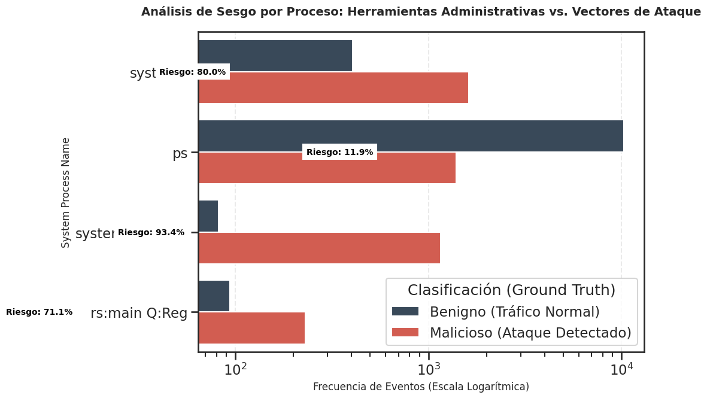
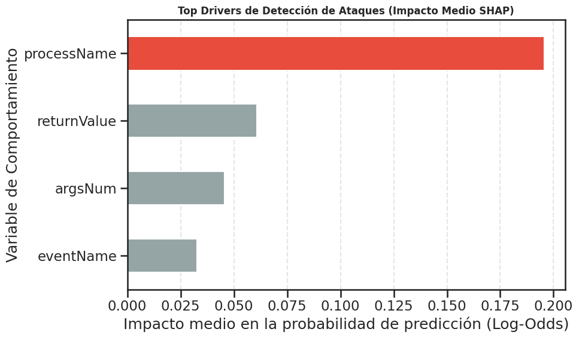
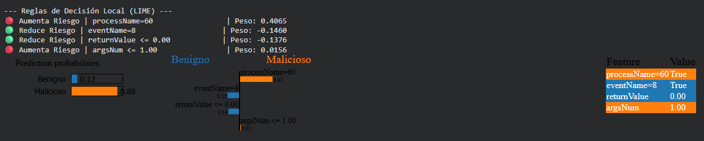

### 2025_301_MIAR0525_A01_SEM4_GRUPAL
Repositorio grupal para los entregables de la actividad grupal de la semana 4 - Grupo 6

### Integrantes
* Diego Arambulo Vitores
* Jesus Zambrano Parrales
* Bryan Alvarado Quimiz

### Informacion sobre el dataset usado
Nuestro dataset fue obtenido del portal de bases abiertas y gratuitas [<a href="https://www.kaggle.com/">kaggle</a>], mas en especifico 
la denominada [<a href="ttps://drive.google.com/uc?id=1LGLypAMRHMw54oCdrSHUC6G80q2k71B_&export=download">BETH</a>], que deriva su nombre de la forma en que captura la informacion real sobre cyberseguridad, que se basa en trampas digitales
denominadas como "honey pots", al cual se le hace un seguimiento extendido para ver su comportamiento. Este set de datos contiene Informacion
real y en constante alimentacion sobre accesos de diversos tipos sobre mas de 20 unidades de honeypots. Para efecto de eficiencia, hemos reducido el dataset original a una version segmentada para ser soportada
para efectos academicos, la misma que puede ser obtenida directo desde el siguiente [<a href="https://drive.google.com/uc?id=16G0p0_DYZXyteQRUrqc0IWn_MkPTyX8A&export=download">link</a>].

### Problemática
La detección de amenazas desconocidas y la identificación proactiva de vulnerabilidades en los entornos de ciberseguridad actuales exigen metodologías que trasciendan las limitaciones inherentes a los datos etiquetados.
Esta dependencia de etiquetas preexistentes representa una debilidad estructural en los sistemas de defensa tradicionales, lo que justifica la adopción de enfoques de aprendizaje no supervisado. 
Dentro de este contexto es importante identificar y mitigar posibles sesgos en datasets de entrenamiento para que los modelos de aprendizaje no estén determinados por variables sesgadas. 

### Objetivo general identificado
Este proyecto se enfoca en la identificación temprana y proactiva de posibles vulnerabilidades y patrones anómalos dentro del sector de la ciberseguridad haciendo uso de un dataset de BETH, a través de la implementación y el análisis avanzado de modelos de aprendizaje no supervisado como K-means, DBSCAN, PCA y t-SNE. 

### Objetivos especificos detectados

1.-Análisis Exploratorio: Analizar el dataset BETH e identificar las características de los accesos más comunes y sus métricas.

2.- Descubrimiento de Patrones: Identificar patrones relevantes de actividad sospechosa, como la frecuencia, el horario, tipo de ataques, etc.

3.- Modelado No Supervisado: Crear y entrenar modelos de Machine Learning no supervisado basados en el dataset para que puedan reconocer de forma exitosa los diferentes clusters de actividad y anomalías en la infraestructura de TI.
	
### Análisis Comparativo entre Modelos

#### ¿Qué tipo de perfiles se pueden identificar?
Entre los perfiles mas notables podemos identificar los siguientes:
Ataques cibernéticos realizados en horarios diurnos
Ataque por apertura de archivos
Ataque iniciados por procesos de sistema
Ataque por apertura de conexión

#### ¿Que resultados se obtuvieron al analizar si existia sesgo en el dataset?
Dentro de los analisis, se pudo evidenciar que el dataset mostraba tendencia a overfiting en ciertos cumulos de informacion como los son: el processName, y el userId, en el siguiente grafico podremos observar un sesgo detectado por proceso
como evento benigno siempre, o cual claramente va a entrenar de forma errada el modelo escogido, en este caso un random forest:

#### ¿Qué resultados se obtuvieron al aplicar los metodos de fairness SHAP y LIME?
Dentro del metodo shap, podemos entender de mejor forma porque el modelo actua o predice los valores y tendencias de una forma u otra, y esto lo aplica basandose en el peso de relevancia que tiene una variable con respecto a una tendencia encontrada
esto lo podremos apreciar de mejor forma en el siquiente diagrama donde, se no indica que la variable processName, es la mas relevante al momento de detectar una anomalia o evento en el dataset.

De la misma forma, LIME, pretende explicar como las perturbaciones hacia un unico registro tomado de la muestra, cambia sus resultados hacia el test realizado a el, esto no permite encontrar como los cambios en las entradas del modelo se traducen
en cambios sutiles o abruptos como resultado del estrato general de informacion. A continuacion podremos observar como el analisis LIME, detecta que processName entra dentro de las reglas de decision por ser altamente relevante a diferencia del 
resto como eventName o args.

### Conclusiones y recomendaciones
- Con la capacidad de sectorizar los puntos de impacto, tal cual nos indica los clusters, podremos ser mas eficientes y estratégicos al momento de ejecutar un mecanismo de contingencia.

- Al momento de realizar las transformaciones necesarias, debemos tener en cuenta que usar datos lineales le darán mayor sentido a nuestra almacen de informacion y por consiguiente en todos los dashboards que usemos. (recordemos que en el caso de la base BETH no existen un numero natural de clusters por lo que la definición de K para K-means puede tornarse conflictiva)

- No existe un modelo de ML perfecto para todos los problemas cotidianos, un analisis y comparativa es necesario para tomar el mas eficiente y adecuado a nuestras necesidades, métodos de redimensionamiento como el PCA pueden ser difíciles de interpretar debido a su capacidad de mezclar señales con ruidos, no deberían ser definitivos en estructuras finales.

- El uso de t-sne, es correcto si solo haremos exploración visual de los resultados, ya que estos serán de carácter ficticio, y no deben usarse para segmentación.
